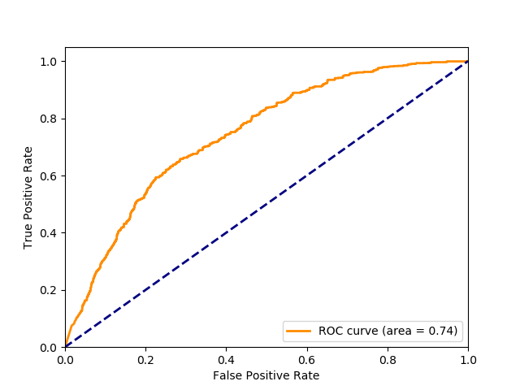

# AnomalyDetectionCVPR2018-Pytorch
Pytorch version of - https://github.com/WaqasSultani/AnomalyDetectionCVPR2018

Code base taken from: https://github.com/ekosman/AnomalyDetectionCVPR2018-Pytorch


## Install anaconda env
```conda env create -f environment.yml```


```conda activate torch```

## Download C3D or 3D Resnet weights
I couldn't upload here the weights for the C3D and 3D ResNet model because the file is too big, but they can be found here:
https://github.com/DavideA/c3d-pytorch
and the 3D ResNets from https://github.com/kenshohara/3D-ResNets-PyTorch

## Precomputed features
From the C3D network can be downloaded from:
https://drive.google.com/drive/folders/1rZn-UHM_EcIXauJ0wRysQbh0mHQoNrfY?usp=sharing

## Features extraction
```python feature_extractor.py --dataset_path "path-to-dataset" --annotation_path "path-to-train-annos" --annotation_path_test "path-to-test-annos" --pretrained_3d "path-to-pretrained-c3d" --feature_extractor "c3d or resnet" ```

## Training
```python TrainingAnomalyDetector_public.py --features_path "path-to-dataset" --annotation_path "path-to-train-annos" --annotation_path_test "path-to-test-annos"```

## Generate ROC curve
```python generate_ROC.py --features_path "path-to-dataset" --annotation_path "path-to-annos"```



## Demo*
"video_demo.py --video_parth_list LIST_OF_VIDEO_PATHS --model_dir PATH_TO_MODLE "
This should take any video and run the Anomaly Detection code (including CD3 feature extraction) and output a video with a graph of the Anomaly Detection prediction on the right-hand side (like in the demo code for the paper).

## Annotation*
"annotation_methods.py --path_list LIST_OF_VIDEO_PATH --dir_list LIST_OF_LIST_WITH_PATH_AND_VIDEO_NAME --normal_or_not LIST_TRUE_FALUE"
This is currently just for demo but will allow training with nex videos

